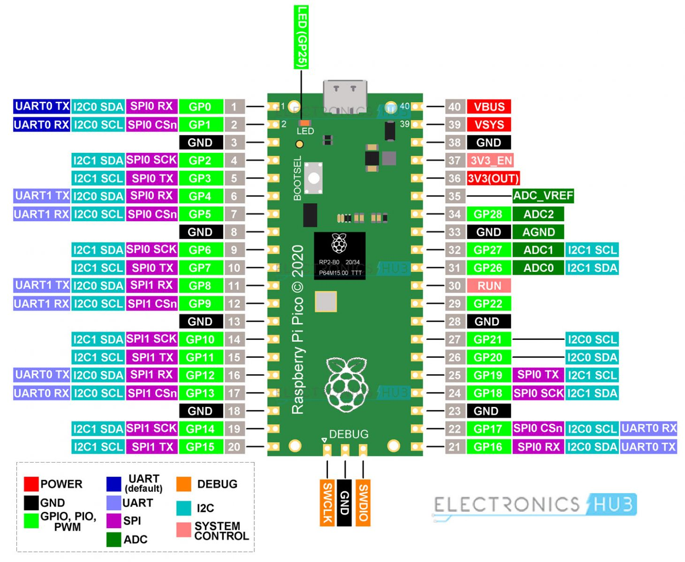

<!-- WARNING: THIS FILE WAS AUTOGENERATED! DO NOT EDIT! -->

## Pinout



### 1. **Setting Up MicroPython on the Raspberry Pi Pico**
   - **Download MicroPython UF2**: Get the UF2 file from the [official MicroPython site](https://micropython.org/download/rp2-pico/).
   - **Flash the Pico**:
     - Hold down the **BOOTSEL** button on the Pico and connect it to your computer via USB.
     - Release the button once it appears as a storage device.
     - Drag the MicroPython UF2 file to the Pico drive. It will reboot with MicroPython installed.

### 2. **Using Thonny IDE for MicroPython**
   - **Install Thonny**: It’s a lightweight IDE for Python and MicroPython.
   - **Configure Thonny**:
     - Open Thonny and go to **Tools > Options > Interpreter**.
     - Select **MicroPython (Raspberry Pi Pico)** as the interpreter and choose the correct USB port.
   - You can now write code in Thonny and run it directly on the Pico.

### 3. **Basics of the `machine` Module in MicroPython**
   - The `machine` module provides access to the hardware components of the Pico, such as GPIO, PWM, ADC, I2C, and SPI.

### 4. **GPIO Basics**

#### LED Blinking Example
To control an LED connected to GPIO pin 15:

```python
from machine import Pin
from time import sleep

# Configure pin 15 as an output
led = Pin(15, Pin.OUT)

# Blink the LED
while True:
    led.toggle()  # Toggle the LED state
    sleep(1)      # Wait 1 second
```

#### Button Input Example
To read a button state connected to GPIO pin 14 with a pull-up resistor:

```python
from machine import Pin
from time import sleep

button = Pin(14, Pin.IN, Pin.PULL_UP)  # Button on pin 14, using internal pull-up

while True:
    if button.value() == 0:  # Button pressed (active low)
        print("Button Pressed!")
    sleep(0.1)
```

### 5. **Using PWM for LED Brightness Control**

To control LED brightness with PWM on GPIO pin 15:

```python
from machine import Pin, PWM
from time import sleep

led = PWM(Pin(15))  # Initialize PWM on pin 15
led.freq(1000)      # Set frequency to 1000 Hz

# Increase and decrease brightness
while True:
    for duty in range(0, 65536, 512):  # Gradually increase brightness
        led.duty_u16(duty)            # Set duty cycle
        sleep(0.01)
    for duty in range(65535, 0, -512):  # Gradually decrease brightness
        led.duty_u16(duty)
        sleep(0.01)
```

### 6. **Analog Input with ADC**
The Pico has three analog input pins: ADC0 (GP26), ADC1 (GP27), and ADC2 (GP28).

#### Read Analog Input Example
To read data from a potentiometer connected to ADC0 (pin GP26):

```python
from machine import ADC
from time import sleep

pot = ADC(26)  # Connect potentiometer to GP26

while True:
    value = pot.read_u16()          # Read 16-bit analog value
    voltage = value * (3.3 / 65535) # Convert to voltage (3.3V reference)
    print("ADC Value:", value, "Voltage:", voltage)
    sleep(1)
```

### 7. **I2C Communication**
The Raspberry Pi Pico supports I2C, allowing communication with various devices like displays and sensors.

#### I2C Setup and Scanning for Devices
To scan for I2C devices connected to I2C0 (default pins SDA: GP4, SCL: GP5):

```python
from machine import Pin, I2C

i2c = I2C(0, scl=Pin(5), sda=Pin(4), freq=400000)  # Set up I2C on GP4, GP5
devices = i2c.scan()  # Scan for connected I2C devices
print("I2C devices found:", devices)
```

### 8. **SPI Communication**
SPI is commonly used to communicate with SD cards, sensors, and displays.

#### Basic SPI Setup
To set up an SPI connection on SPI0 (SCK: GP2, MOSI: GP3, MISO: GP4):

```python
from machine import Pin, SPI

spi = SPI(0, baudrate=1000000, polarity=0, phase=0, sck=Pin(2), mosi=Pin(3), miso=Pin(4))

# To read and write data, use spi.read() and spi.write() functions.
```

### 9. **Using the Built-in Timer**
Timers are useful for scheduling periodic tasks.

```python
from machine import Timer

def blink(timer):
    led.toggle()  # Toggle the LED every second

led = Pin(15, Pin.OUT)
timer = Timer()
timer.init(freq=1, mode=Timer.PERIODIC, callback=blink)  # Call blink() every second
```

### 10. **UART Communication**
The Pico has two UART peripherals, allowing serial communication with other devices.

#### UART Setup and Communication
Set up UART0 (TX: GP0, RX: GP1):

```python
from machine import UART

uart = UART(0, baudrate=9600, tx=Pin(0), rx=Pin(1))

# Write data
uart.write("Hello from Pico!")

# Read data
if uart.any():  # Check if data is available
    data = uart.read()
    print("Received:", data)
```

### 11. **A Full Example: Temperature and LED Control with ADC and PWM**

This example reads the temperature using an analog temperature sensor and dims an LED based on the temperature reading.

```python
from machine import Pin, PWM, ADC
from time import sleep

led = PWM(Pin(15))  # LED connected to GP15
led.freq(1000)
temp_sensor = ADC(4)  # Internal temperature sensor (connected to ADC4)

while True:
    reading = temp_sensor.read_u16()      # Read temperature sensor value
    temperature = 27 - (reading - 0.706) / 0.001721  # Convert to Celsius

    # Map temperature to LED brightness (for example, scale 0-50 C to 0-65535 PWM duty)
    brightness = int(min(temperature, 50) / 50 * 65535)
    led.duty_u16(brightness)

    print("Temperature:", temperature, "°C", "LED Brightness:", brightness)
    sleep(1)
```

### 12. **Saving and Running Scripts on Boot**
To automatically run a script on boot, save it as `main.py` on the Pico’s filesystem:

1. Write the script in Thonny.
2. Go to **File > Save as** and save it as `main.py` on the MicroPython device.
3. When the Pico is powered up, it will automatically execute `main.py`.

### Additional Tips
- **Error Handling**: Use `try` and `except` blocks to catch errors and prevent crashes.
- **GPIO Cleanup**: Use `.deinit()` to reset pins when they are no longer needed.

This provides a solid foundation for working with the Raspberry Pi Pico and MicroPython, enabling you to create anything from simple GPIO controls to complex sensor interfaces and communication with other devices.

